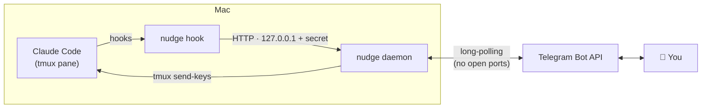

<div align="center">

# 🛰 Nudge

**Step away from your desk and keep Claude Code working.**

Nudge connects Claude Code, running in tmux on your Mac, to Telegram on your phone.
Claude keeps doing the work locally, and Nudge contacts you only when you need to step in.

`approve from your phone` · `reply to Claude` · `see what it built` · `know when it's done`

</div>

---

## Why

Long Claude Code tasks tend to stall the moment you leave the room. Claude needs permission to run a command, has a question, or has finished and is waiting for the next instruction. Nudge sends those moments to Telegram so you can handle them from anywhere:

> 🔐 **[my-app · 3f9a1c]** `Bash` needs approval
> ```
> npm run build && npm test
> ```
> `✅ Approve` `❌ Deny` `✅ Always allow Bash (this session)`

Tap a button and Claude continues on your Mac.

## Features

| | |
|---|---|
| 🔐 **Remote approvals** | Tool permission prompts arrive with **Approve / Deny / Always-allow** buttons. Reply with text instead to deny and tell Claude why. |
| ↩️ **Talk back** | Anything you type in Telegram is typed into Claude's tmux pane. Reply to a specific message to target that session. |
| ✅ **Turn summaries** | When Claude finishes a turn, you get its final message. |
| 🔔 **Attention alerts** | "Claude is waiting for your input" notifications are forwarded. |
| 🖼 **Screenshots** | See UI changes: browser screenshots from Claude in Chrome are forwarded, Claude can run `nudge shot`, or you can ask with `/shot 3000`. |
| 📟 **Peek at the terminal** | `/tail` shows the last lines of the pane. `/esc` interrupts Claude. `/keys` sends raw keys. |
| 🧵 **Multi-session** | Every message is tagged `[project · session]`. Run several Claude sessions at once and replies go to the right one. |
| 🏠 **Only when you're away** | Nothing is sent until you run `/nudge on`. At your desk, Claude behaves exactly as usual. |

## How it works



- **Claude Code hooks** (`PermissionRequest`, `Notification`, `Stop`, `SessionStart/End`, `PostToolUse`) call `nudge hook <event>`.
- The hook exits immediately unless away mode is on. When it's on, the hook forwards the event to the local **daemon**. For approvals, it waits for your tap.
- The daemon talks to Telegram by **long-polling**, so no webhook, tunnel or open port is needed.
- Your replies are typed into the right tmux pane with `tmux send-keys`.

## Requirements

- macOS (the auto-start setup uses launchd; everything else is portable)
- [Node.js](https://nodejs.org) ≥ 20
- [tmux](https://github.com/tmux/tmux) (`brew install tmux`)
- [Claude Code](https://claude.com/claude-code)
- A Telegram account
- *Optional:* Google Chrome for `nudge shot` / `/shot`. Without it, run `npx playwright install chromium`.

## Installation

**1. Build and link the CLI**

```sh
git clone https://github.com/randomsapiens1/nudge.git
cd nudge
npm install && npm run build && npm link
```

**2. Create your bot and link it**

In Telegram, message [@BotFather](https://t.me/BotFather), send `/newbot`, and copy the token. Then:

```sh
nudge init --token <YOUR_BOT_TOKEN>
```

Open your new bot and send `/start` within 3 minutes. Nudge saves your chat id and confirms in Telegram.

**3. Install hooks, the `/nudge` command and the auto-start daemon**

```sh
nudge install --launchd
```

This backs up `~/.claude/settings.json` before making any change.

## Usage

```sh
tmux new -s work
claude
```

In Claude Code:

```
/nudge on       # leaving your desk: forward everything to Telegram
/nudge off      # back: everything stays local
/nudge status
```

> Claude Code loads hooks at startup. Restart any sessions that were open before `nudge install`.

### Telegram commands

| Command | What it does |
|---|---|
| *any text* | Types it into Claude's pane and presses Enter. Unknown slash commands such as `/compact` are passed through too. |
| *reply to a message* | Sends to that message's session. Replying to an approval with text denies it and passes your reason to Claude. |
| `/status` | Shows away mode, pending approvals and all sessions. |
| `/tail [n]` | Shows the last *n* lines of the pane (default 40). |
| `/shot <url\|port> [--full]` | Screenshots a page, e.g. `/shot 3000`. |
| `/esc` | Presses Escape to interrupt Claude. |
| `/keys <keys…>` | Sends raw tmux keys, e.g. `/keys Down Enter`. |
| `/away on\|off` | Toggles away mode from your phone. |

### CLI

| Command | What it does |
|---|---|
| `nudge init [--token T]` | Links a bot and chat. |
| `nudge install [--launchd]` | Installs hooks and the `/nudge` command, and optionally auto-starts the daemon. |
| `nudge uninstall` | Removes Nudge's hooks and stops the daemon. |
| `nudge daemon` | Runs the bridge in the foreground. |
| `nudge away [on\|off\|toggle]` | Shows or sets away mode. |
| `nudge shot <url\|port> [--full] [-c caption]` | Screenshots a page and sends it to Telegram. |
| `nudge status` | Shows configuration and daemon health. |

## Screenshots of your UI

While away mode is on, there are three ways to get screenshots:

1. **Automatically.** When Claude uses Claude in Chrome to take a screenshot, the image is forwarded. This is limited to one every 20 seconds per session.
2. **Claude sends it.** `/nudge on` tells Claude to run `nudge shot <url>` after visible UI changes.
3. **You ask for it.** Send `/shot localhost:5173/settings` from your phone.

## Safety

- **Nudge never approves anything by itself.** If you don't answer within about 10 minutes, the daemon is down, or away mode is off, Claude shows its normal local prompt.
- **Only your chat is obeyed.** Messages from any other chat are ignored.
- **Secrets stay local.** The bot token and a random API secret live in `~/.nudge/config.json` (mode `0600`).
- **Loopback only.** The daemon's API binds to `127.0.0.1` and requires the secret header.
- **No shell injection.** tmux runs through `execFile` with argument arrays, never through a shell.

## Files

| Path | Purpose |
|---|---|
| `~/.nudge/config.json` | Bot token, chat id, port, secret |
| `~/.nudge/state.json` | Away mode on/off |
| `~/.nudge/daemon.log` | Daemon logs (launchd) |
| `~/.claude/settings.json` | Hooks (each marked `# nudge`) |
| `~/.claude/commands/nudge.md` | The `/nudge` slash command |
| `~/Library/LaunchAgents/com.nudge.daemon.plist` | Auto-start |

## Troubleshooting

<details>
<summary><b><code>nudge: command not found</code></b></summary>

Run `npm link` inside the repo. Check with `which nudge`; it should be in your npm global bin, for example `/opt/homebrew/bin`.
</details>

<details>
<summary><b><code>Conflict: terminated by other getUpdates request</code></b></summary>

Two programs are polling the same bot, for example two `nudge init` runs, or `nudge daemon` running alongside the launchd copy. Stop one of them.
</details>

<details>
<summary><b>Nothing arrives in Telegram</b></summary>

- `nudge status`: is the daemon running and away mode on?
- Was this Claude session started **after** `nudge install`?
- Check the log with `tail -f ~/.nudge/daemon.log`.
</details>

<details>
<summary><b>Replies don't reach Claude</b></summary>

Claude must be running **inside tmux**, because Nudge finds the pane through `$TMUX_PANE`. `/status` shows which pane each session is using.
</details>

## Development

```sh
npm run dev      # tsc --watch
npm test         # vitest
npm run build
```

```
src/
├── cli.ts           # commander entry point
├── hook.ts          # Claude Code hook handler (fails open, silently)
├── daemon/
│   ├── bot.ts       # grammY bot: commands, buttons, reply routing
│   ├── server.ts    # local HTTP API used by hooks
│   └── sessions.ts  # session ↔ pane registry
├── install.ts       # settings.json merge, slash command, launchd
├── init.ts          # bot linking
├── shot.ts          # headless screenshots (playwright-core)
├── tmux.ts          # send-keys / capture-pane
└── transcript.ts    # last assistant message from the JSONL transcript
```

## License

[MIT](LICENSE) © randomsapiens1

---

<div align="center">
<sub>Claude does the work. Nudge brings you in when it matters.</sub>
</div>
